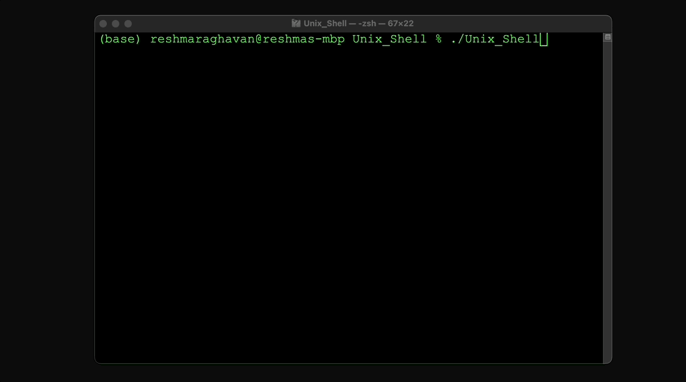

# Unix Shell

## Overview

This Unix Shell project is a custom shell implementation developed in C++, drawing inspiration from well-known environments like `bash` and `zsh`. Utilizing POSIX system calls, the shell can interpret lines of input as individual user commands, proficiently managing operations such as `ls`, `cat textfile.txt`, and `echo hello world`. Beyond this, the shell is equipped with I/O redirection, piping, and offers a smooth user experience with features like tab completion.

## Demo



### Features:
- **Command execution:** Supports basic commands like `ls`, `cat`, and `echo`.
- **I/O Redirection:** Handle input and output redirection.
- **Piping:** Chain commands together using pipes.
- **Tab Completion:** Suggest command completions to improve user experience.

## Installation and Setup

### Prerequisites

- **CMake** (version 3.15 or higher)
- **C++ Compiler** (e.g., g++, clang++)

Ensure you have CMake and a C++ compiler installed on your system. You can download CMake from the (CMake official website)[https://cmake.org/download/] and the compiler from the (GNU Compiler Collection)[https://gcc.gnu.org/] or via your package manager.

### Building the Project

1. **Clone the repository:**

   ```sh
   git clone https://github.com/reshmar00/Unix_Shell.git

2. **Configure the build with CMake::**

   ```sh
    cmake .

3. **Build the project:**

   ```sh
    make

## Running the Shell

After the build process completes successfully, you can run the shell with the following command:

```
./Unix_Shell
```

**Example Usage**

```
(base) user@profile Unix_Shell % ./Unix_Shell 
ls
exec start: ls
CMakeCache.txt		README.md		main.cpp
CMakeFiles		StatesnCapitals.txt	shelpers.cpp
CMakeLists.txt		Unix_Shell		shelpers.hpp
Makefile		cmake_install.cmake	textfile.txt

cat textfile.txt
exec start: cat
Hey! This is what I have inside my textfile.txt
Here are some numbers: 0123456789
Here are some special characters: !@#$%^&*()
Goodbye!

echo hello 123!
exec start: echo
hello 123!

```

## Additional Information
### Project Structure

- **main.cpp**: Main source file containing the core loop of the shell.
- **shelpers.cpp**: Helper functions for shell operations.
- **shelpers.hpp**: Header file for the helper functions.
- **CMakeLists.txt**: CMake build configuration file.
- **Makefile**: Makefile generated by CMake for building the project.
- **StatesnCapitals.txt**: Sample text file used for testing.
- **textfile.txt**: Another sample text file used for testing.- **unixShellDemo.gif**: Demo of the Unix Shell in action.

Feel free to reach out if you have any questions or need further assistance. Enjoy using the Unix Shell!
